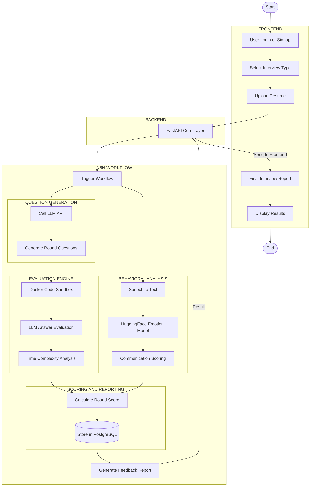

# PrepAI.io

## Problem
Many candidates struggle with interview anxiety and lack structured, realistic practice before facing real interviews. Traditional preparation methods often fall short because they do not provide objective, real-time feedback on both the technical accuracy of answers and the candidate's behavioral communication skills.

## Solution
PrepAI.io is an AI-powered interview practice platform designed to simulate real HR and Technical interviews. By analyzing not just what candidates say but how they say it, PrepAI.io provides a comprehensive evaluation of technical accuracy, coding time complexity, and behavioral metrics (such as facial expressions, speaking pace, and confidence). This enables candidates to systematically improve their performance with data-driven feedback.

## Features
- Voice-first AI interview simulations with natural conversation capabilities.
- Real-time behavioral tracking including eye contact, posture, and facial expression analysis.
- Custom interview question generation tailored through automated resume parsing.
- Support for multiple interview formats, including HR and Technical rounds.
- Automated technical evaluation engine featuring a Docker-based code sandbox and time complexity analysis.
- Comprehensive scoring system that combines behavioral communication metrics and technical proficiency.
- Detailed post-interview feedback reports with historical data storage.

## Tech Stack
- **Frontend**: Next.js 16 (App Router), TypeScript, Tailwind CSS, shadcn/ui
- **Backend Core**: FastAPI, Next.js API Routes
- **Workflow Automation**: N8N
- **AI & Machine Learning**: Vercel AI SDK, HuggingFace Emotion Models, LLM APIs
- **Database**: PostgreSQL
- **Browser APIs**: Web Speech API, MediaDevices API

## System Architecture



## Setup

### Prerequisites
- Node.js 18+
- pnpm (recommended) or npm
- Python 3.9+ (for FastAPI core)
- Docker (for code sandbox)
- PostgreSQL
- N8N instance

### Installation
1. Clone the repository:
   ```bash
   git clone https://github.com/VIDYANKSHINI/PrepAI.io.git
   cd PrepAI.io
   ```

2. Install frontend dependencies:
   ```bash
   pnpm install
   ```

3. Configure environment variables (create a `.env.local` file with required API keys and database credentials).

4. Start the development server:
   ```bash
   pnpm dev
   ```

## Usage
1. Open the application in a modern browser (Chrome or Edge recommended).
2. Create an account or log in.
3. Select your desired interview type (HR or Technical).
4. Upload your resume to allow the AI to tailor the interview questions.
5. Grant necessary permissions for your camera and microphone.
6. Complete the interactive interview session.
7. Review your final interview report, including behavioral and technical scores.

## Screenshots
*(Add relevant screenshots of the application here)*

## Demo
*(Add a link to the live demo or a demonstration video here)*

## Team
- **Vidyankshini Vibhute**: Frontend Development, UI Integration, User Experience
- **Aditya Yelmar**: UI/UX Design, Market Research
- **Shravani Tanksale**: Core Backend, API Development
- **Siddhesh Waghmare**: Backend Support, Growth Analysis

## License
This project is licensed under the MIT License.
