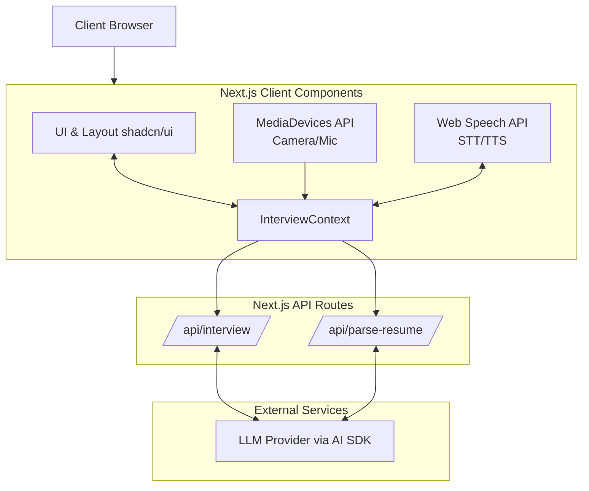

# PrepAI.io - AI-Powered Interview Practice Platform

<p align="center">
  <em>A comprehensive, real-time AI interview practice platform that helps users master their interviews through voice-first AI conversations, video analysis, and detailed behavioral feedback.</em>
</p>

## 🌟 Features

### 🎙️ Core Functionality
- **Voice-First AI Interviews**: Natural conversation with < 2 second latency using Web Speech API for speech recognition and synthesis.
- **Real-Time Video Analysis**: Live webcam feed with behavioral metrics tracking.
- **Resume Parsing**: Upload PDF resumes for AI-generated custom interview questions.
- **Multi-Type Interviews**: Support for HR and Technical interview formats.
- **5-Question Sessions**: Structured interview flow with skip/next navigation.

### 🤖 AI Interviewer
- Professional AI interviewer avatar ("Sarah") that speaks questions aloud.
- Natural female voice synthesis with multiple voice options.
- Visual speaking indicator when AI is talking.
- Smooth question transitions with audio feedback.

### 📊 Behavioral Analysis
Real-time tracking and analysis of:
- **Eye Contact**: Camera-based gaze detection.
- **Posture Analysis**: Body positioning and professionalism.
- **Facial Expressions**: Confidence, happiness, neutrality, nervousness breakdown.
- **Speaking Pace**: Words per minute analysis.
- **Fluency Score**: Natural speech flow measurement.
- **Filler Words**: Detection and counting of "um", "uh", "like", etc.
- **Response Time**: Per-question timing metrics.

## 🏗️ System Architecture

The architecture is built on a modern Next.js 16 (App Router) foundation, leveraging browser APIs for media and speech, and the Vercel AI SDK for intelligence.



### Application Flow
1. **Home (`/`)**: Landing page with value proposition and CTA.
2. **Setup**: Configure interview details (name, role, type, permissions, optional resume upload).
3. **Live Interview**: 5-question AI interview with camera/mic.
4. **Results**: Score summary with option to view detailed analysis.
5. **Analysis**: In-depth behavioral feedback and recommendations.

## 💻 Tech Stack

- **Framework**: Next.js 16 (App Router)
- **Language**: TypeScript
- **Styling**: Tailwind CSS with custom design tokens
- **UI Components**: shadcn/ui, Radix UI
- **APIs**: Web Speech API, MediaDevices API
- **AI Integration**: Vercel AI SDK

## 📂 Project Structure

```text
app/
├── api/
│   ├── interview/          # AI conversation endpoint
│   └── parse-resume/       # Resume parsing endpoint
├── globals.css             # Global styles and design tokens
├── layout.tsx              # Root layout with fonts
└── page.tsx                # Main page with step routing

components/
├── feature-highlights.tsx  # Landing page features grid
├── hero-section.tsx        # Landing page hero
├── interview-analysis.tsx  # Detailed analysis view
├── interview-results.tsx   # Results summary view
├── interview-session.tsx   # Live interview UI
├── interview-setup.tsx     # Interview configuration form
└── prep-logo.tsx           # Brand logo component

lib/
├── interview-context.tsx   # React context for interview state
└── utils.ts                # Utility functions
```

## 🚀 Getting Started

### Prerequisites
- Node.js 18+
- pnpm (recommended) or npm

### Installation

1. Clone the repository:
   ```bash
   git clone https://github.com/VIDYANKSHINI/PrepAI.io.git
   cd PrepAI.io
   ```

2. Install dependencies:
   ```bash
   pnpm install
   ```

3. Run the development server:
   ```bash
   pnpm dev
   ```

4. Open [http://localhost:3000](http://localhost:3000) with your browser to see the result.

## 🌐 Browser Compatibility

Requires modern browsers with support for:
- Web Speech API (Chrome, Edge recommended for best experience)
- MediaDevices API (getUserMedia)
- ES2020+ JavaScript features

## 🎨 Design & Accessibility

- **Responsive**: Fully responsive across mobile, tablet, and desktop viewports.
- **Theming**: Sleek dark theme with carefully selected HSL color tokens for high contrast and modern feel.
- **Accessibility**: Semantic HTML, ARIA labels, keyboard navigation, and screen reader compatibility.

## 📄 License

MIT License - See LICENSE file for details.

---
*Built with ❤️ using Next.js, Tailwind CSS, and AI SDK by the PrepAI.io team.*
